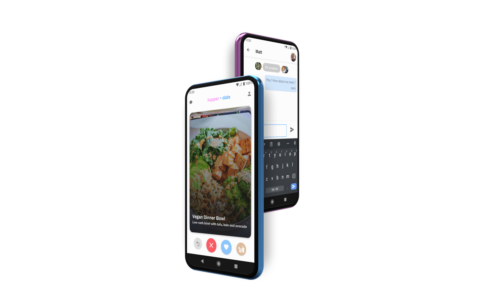

# heig-PDG/mono

[Check our project out on YouTube !](https://youtu.be/Yxxu8m0TN3M)

An Android and web application to match and meet people based on meals, recipes and tupperwares. This is a semester project done at HEIG-VD.

More information is available on the [class repository on GitLab](https://gitlab.com/softeng-heigvd/teaching-heigvd-pdg-2020/guidelines).

## Team

| Name                                   |                                  |
|----------------------------------------|----------------------------------|
| Matthieu Burguburu 					 | matthieu.burguburu@heig-vd.ch    |
| David Dupraz                           | david.dupraz@heig-vd.ch          |
| Alexandre Piveteau 				     | alexandre.piveteau@heig-vd.ch    |
| Guy-Laurent Subri                      | guy-laurent.subri@heig-vd.ch     |

## Structure

We use a mono-repository approach to store and manage the files of our project. We also make use of some external tools for [prototyping](https://www.figma.com).

The sub-folder structure is as follows:

- `.github/` contains GitHub-specific files, such as issue templates, and the workflows that run whenever we make changes to the app;
- `docker` contains our different docker images, and our Docker-related scripts;
- `spec/` contains our [OpenAPI spec](http://spec.tupperdate.me),
- `src/` contains the source code of our application;
- `vcs` contains some scripts related to our VCS;
- `website/` contains our landing page; amd
- `wiki/` contains our reference branding as well as details over our collaboration process.

**Our prototypes are visible on Figma ([overview](https://www.figma.com/file/sZTqSZOMoUmuJTMhw7khx3/Mobile?node-id=1%3A2), [live prototype](https://www.figma.com/proto/sZTqSZOMoUmuJTMhw7khx3/Mobile?node-id=158%3A380&viewport=849%2C581%2C0.3042562007904053&scaling=scale-down)).**

## Local Setup

**Warning**:
In order to run the backend locally, some setup will need to be done. As it is quite cumbersome, we highly recommend that you would use the live version, which is available on [api.tupperdate.me](https://api.tupperdate.me/). The Android application is available [here](https://github.com/heig-PDG/mono/releases/tag/1.0.0).

### Environment variables

To build the backend, you will need to setup a Firebase project and have the following environment variables set up:

+ Your [Google Service Account](https://cloud.google.com/iam/docs/service-accounts): `GOOGLE_SERVICE_ACCOUNT`;
+ `GOOGLE_DATABASE_NAME`, which is the link to your google firebase database;
+ And your `GOOGLE_BUCKET_NAME`, which should also be given to you by the Firebase Console.

To build the application, you will need to [sign the app](https://developer.android.com/studio/publish/app-signing). You will also need to provide your own `src/mobile/google-services.json`.
