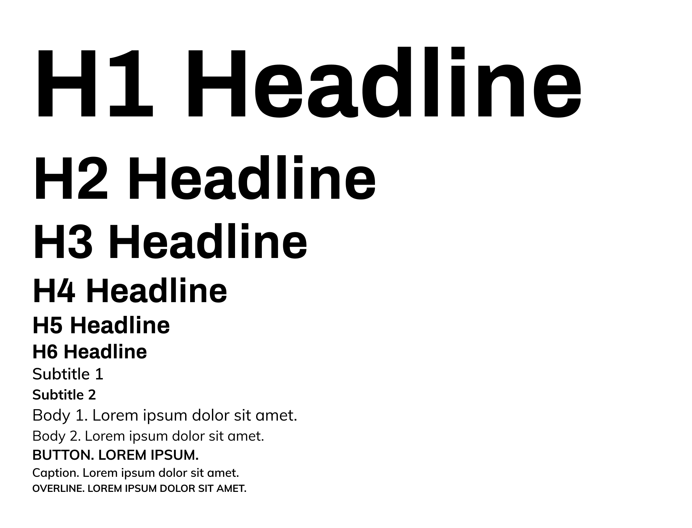

# Branding

A strong and consistent branding is what makes tupperdate.me stand out ! Consistent fonts, colors, metrics, expression and illustrations help create a great experience.

> The design system must be followed on all platforms, including the web and Android. Nevertheless, apps should remain as native as possible to the UX and UI expectations of each platform.

## Colors

The primary color of the application is Smurf, with primary shades of **500** and **600**.

-  Smurf 100 (`#E6F3FF`)
-  Smurf 200 (`#D3E9FE`)
-  Smurf 300 (`#A8D5FF`)
-  Smurf 400 (`#8EC8FF`)
-  Smurf 500 (`#60B2FF`)
-  Smurf 600 (`#339CFF`)
-  Smurf 700 (`#0A88FF`)
-  Smurf 800 (`#0069CC`)
-  Smurf 900 (`#004280`)

Occasionally, a secondary color, Flamingo, may be used in some components, to provide a contrast to the primary color. For instance, gradients might use a combination of Smurf and Flamingo.

-  Flamingo 100 (`#FFE8FE`)
-  Flamingo 200 (`#FECFFC`)
-  Flamingo 300 (`#FCBEFA`)
-  Flamingo 400 (`#FEAFFB`)
-  Flamingo 500 (`#FF99FB`)
-  Flamingo 600 (`#FF6BF9`)
-  Flamingo 700 (`#CC00C4`)
-  Flamingo 800 (`#990093`)
-  Flamingo 900 (`#660062`)

## Typography

Typography is based on Android's typographic system. Fonts are described using the following format `**name** : font, weight, size, (opt.) additional info`.

There are 6 headline fonts, with different heights, depending on the context in which they are used.

- **H1 Headline** : Archivo, Bold, 96
- **H2 Headline** : Archivo, Bold, 60
- **H3 Headline** : Archivo, Bold, 48
- **H4 Headline** : Archivo, Bold, 34
- **H5 Headline** : Archivo, Bold, 24
- **H6 Headline** : Archivo, Bold, 20

Some extra font variants are provided for subtitles, text body, as well as button, caption and overline use-cases.

- **Subtitle 1** : Mulish, Semibold, 16
- **Subtitle 2** : Mulish, Bold, 14
- **Body 1** : Mulish, Regular, 16
- **Body 2** : Mulish, Regular, 14
- **Button** : Mulish, Bold, 14, CAPITALIZATION ON EVERY LETTER
- **Caption** : Mulish, Semibold, 12
- **Overline** : Mulish, Bold, 10, CAPITALIZATION ON EVERY LETTER

The following conversion table should be used to convert font sizes, depending on your platform :

| Platform         | Android | iOS  | Web               |
|------------------|---------|------|-------------------|
| Font size unit   | `sp`    | `pt` | `rem`             |
| Conversion ratio | 1.0     | 1.0  | 0.0625, or (1/16) |

The [Material Design type scale website](https://material.io/design/typography/the-type-system.html#type-scale)
offers a good overview of platform-specific considerations when it comes to
fonts.

### Illustration

