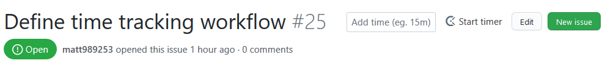
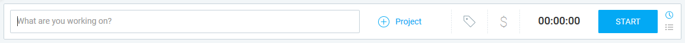
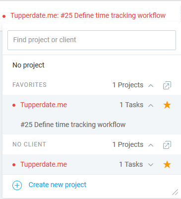
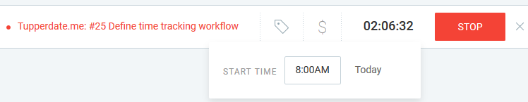
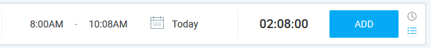

# Time Tracking

This document explains how to setup and use the chosen time tracking application.

# Chosen software

The time tracker that will be used is "Clockify". Download the browser extension at https://clockify.me/.

# Workflow

Time tracking happens on a per-issue basis. To track time for an issue, follow the following steps:

1. Create an issue on GitHub concerning what you plan to work on. Use one of the pre-defined templates if possible, and fill in the required information as usual. Do not forget to fill-in the Schedule section with the time estimation, and, once you're finished with the issue, add the actual time spent in the issue to improve visibility for people that do not use clockify.

2. To start tracking your time using Clockify, click on the "Start timer" button next to the issue's title. This will create a "Time entry" with the same name as your issue in your Clockify profile and begin tracking time for it.\

3. Head on to https://clockify.me/tracker, go to the "Project" tab and select the "Tupperdate.me" project. Add a new task with the same title as the automatically generated "Time entry", and assign yourself to this task. On this task, you can set the time estimate your wrote in the issue.\
Alternatively, you can skip step 2 and create the task manually, following this naming convention: "#IssueNumber IssueTitle"

4. Go back to the "Time tracker" tab, find the active "Time entry" and click on the "+ Project" button. Here, you can select tupperdate.me as a project.\

Now, select the task you just created as the corresponding task for your "Time entry", under the dropdown window for the tupperdate.me project.\

5. Once you're done with your work or you wish to take a break, stop the timer for your task, either from the Clockify interface, or using the integrated button on the GitHub issue. You can start working on your issue at any time by clicking on the "Start button" again.

# Manual time entry

If you forgot to track your time using the Clockify timer, or you started the timer some time after you started working on your issue, you can add a manual time entry from the clockify website.

1. If you've started tracking your time late, you can click on the timer (the current time spent display) and set the time at which you started working on your task.\

2. If you completely forgot to track your time for a task, you can create a manual time entry. You must not have an active timer for this. On the right of the tab to start a new time entry, click on the icon on the bottom right. This will switch to manual time entry mode, and allow you to enter the starting time, ending time and date of your work.\
